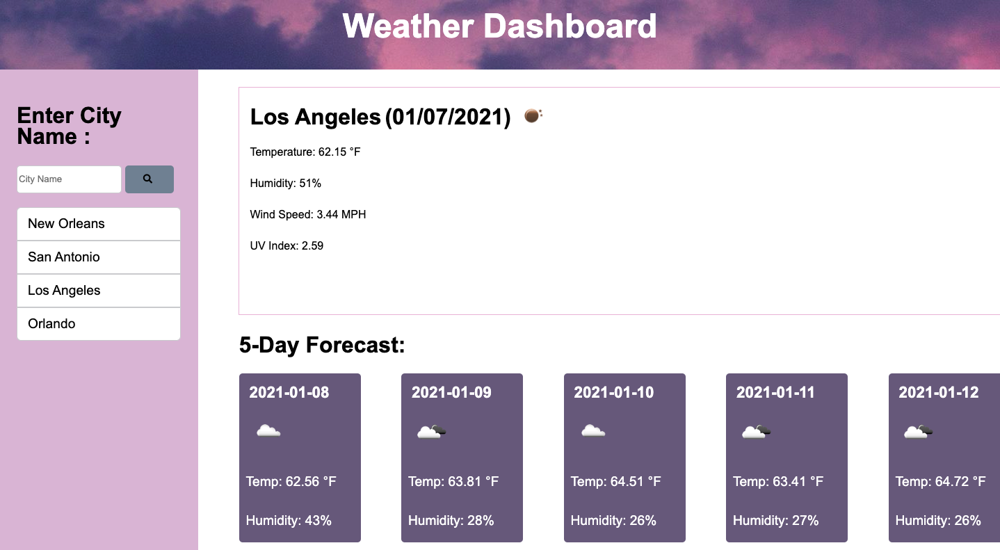

# WeatherApp
functional and interactive weather application

Input what city you would like to know the weather of. Website will store a history locally of the past cities you have looked up for easier access. There will be a 5 day weather forecast below and a in the current forecast there is the temp, wind speed, humidity percentage, and uv index. 

Screenshot of page in use: 

Live Website Link: 

https://bethtgreen.github.io/WeatherApp/